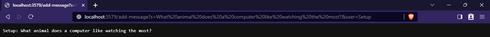
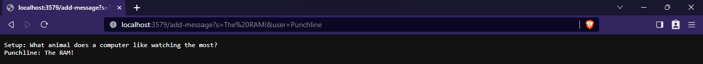

# Lab Report 2: Servers and SSH Keys (Week 3)
This lab consisted of creating a web server called `ChatServer` and exploring public/private keys with SSH.

## Part 1: ChatServer
The server was written by using the [wavelet server example](https://github.com/ucsd-cse15l-f23/wavelet) as a template. The entire folder was reused and unchanged, except the `NumberServer.java` file which was renamed to `ChatServer.java` and modified to contain the following classes:
```
class ChatServer {
    public static void main(String[] args) throws IOException {
        if(args.length == 0){
            System.out.println("Missing port number! Try any number between 1024 to 49151");
            return;
        }

        int port = Integer.parseInt(args[0]);

        Server.start(port, new Handler());
    }
}
```
```
class Handler implements URLHandler {
    //contains messages to display
    String display = "";

    public String handleRequest(URI url) {
        if(url.getPath().equals("/")) return display;
        else if (url.getPath().contains("/add-message")) {
            String[] parameters = url.getQuery().split("=");
            if (parameters[0].equals("s")) {
                String message = "";
                String user = "";
                String[]subParam = parameters[1].split("&");
                message = subParam[0];
                if(subParam[1].equals("user")) {
                    user = parameters[2];
                }
                return display += user + ": " + message + "\n";
            }
        }
        return "404 Not Found!";
    }
}
```
To start the server, the `main()` method in the `ChatServer` class was called with the argument `3579` to indicate the port on which to run the server. Then the `Server.start()` method was called with the port and a new `Handler` as arguments to specify the server's behavior.
An example of using `/add-message` can be seen below:

Initially, the `display` value in `Handler` was an empty String. When the URL was inputted, the `handleRequest()` method was called with the URL as the argument. The `handleRequest()` method made local `message` and `user` variables from the URL, then concatenated these reformatted Strings to `display`. When `/add-message` was used again:

The `handleRequest()` was called again with a different URL. New local `message` and `user` variables were derived from the new URL, then concatenated to `display`. The `display` String retained the previous message because it is an instance variable in the `Handler`. This means it does not reset to an empty string unless the server stops running.

## Part 2: Public/Private Keys


## Part 3: Reflection
