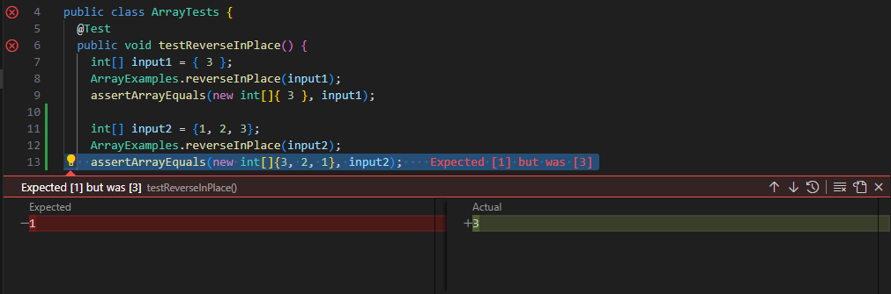

# Lab Report 3: Bugs and Commands (Week 5)

## Part 1: Bugs
Failure-inducing input:
```
@Test 
public void testReverseInPlace() {
  int[] input2 = {1, 2, 3};
  ArrayExamples.reverseInPlace(input2);
  assertArrayEquals(new int[]{3, 2, 1}, input2);
}
```
Non-failure-inducing input:
```
@Test 
public void testReverseInPlace() {
  int[] input1 = { 3 };
  ArrayExamples.reverseInPlace(input1);
  assertArrayEquals(new int[]{ 3 }, input1);
}
```
Symptom:

Bug before code change:
```
static void reverseInPlace(int[] arr) {
  for(int i = 0; i < arr.length; i += 1) {
    arr[i] = arr[arr.length - i - 1];
  }
}
```
Bug after code change:
```
static void reverseInPlace(int[] arr) {
  int[] newArr = new int[arr.length];
  for(int i = 0; i < arr.length; i += 1) {
      newArr[i] = arr[arr.length - i - 1];
  }
  for(int i = 0; i < arr.length; i += 1) {
      arr[i] = newArr[i];
  }
}
```

## Part 2: Researching Commands
