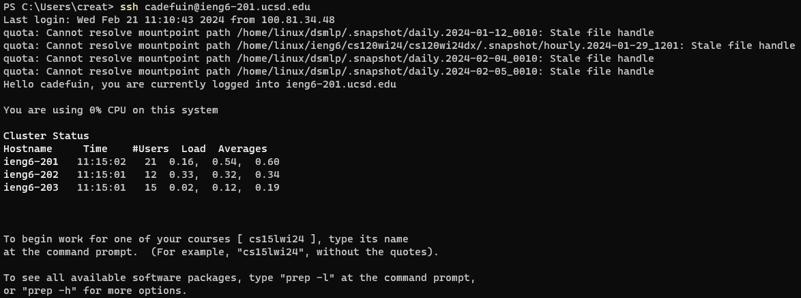
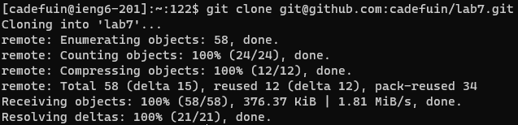
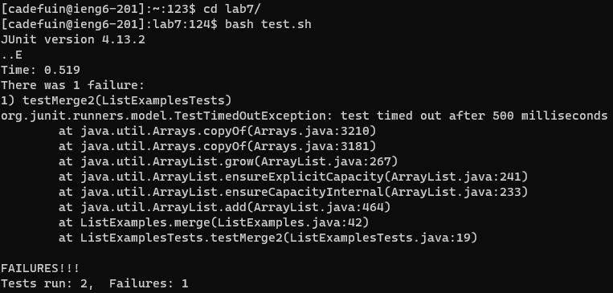
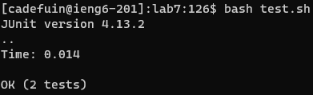
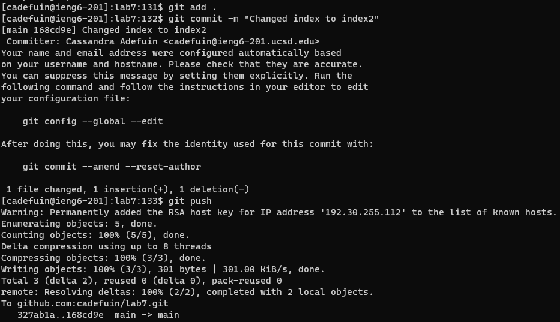

# Lab Report 4: Vim (Week 7)
This lab introduced the vim editor and challenged me to make changes all from the command line.

## Step 1: Log into ieng6

I typed `ssh cadefuin@ieng6-201.ucsd.edu <enter>`

## Step 2: Clone your fork of the repository from your Github account (using the SSH URL)

I typed `git clone <ctrl+v> <enter>`. I pasted the SSH url with `<ctrl+v>`.

## Step 3: Run the tests, demonstrating that they fail

First I changed the directory with `cd l <tab> <enter>`. Using `<tab>` autocompleted `l` to `lab7/`. Then I ran the tests with `bash t <tab> <enter>` to autocomplete `t` to `test.sh`

## Step 4: Edit the code file to fix the failing test

First I opened the vim editor with `vim L <tab> .java`. Using `<tab>` autocompleted `L` to `ListExamples`. Then I typed `r2 :wq <enter>` to replace 1 with 2, since my cursor was already in the proper place.

## Step 5: Run the tests, demonstrating that they now succeed

I pressed `<up> <up> <enter>` to rerun the bash script.

## Step 6: Commit and push the resulting change to your Github account (you can pick any commit message!)

I typed `git add . <enter>` `git commit -m "Changed index1 to index2" <enter>` `git push <enter>`.

