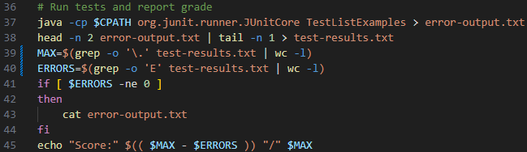
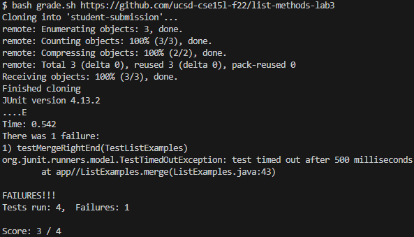

# Lab Report 5: Putting it All Together (Week 9)
This lab navigates a debugging scenario with the Week 6/9 grading script and reflects on the latter half of the quarter.

## Part 1: Debugging Scenario

1. Original post from a student
  > ### grep -o not counting occurrences properly
  > To calculate the grade, I am trying to count the number of times `.` and `E` appear in the JUnit error message. This is my `grade.sh` script: <br> <br>
  >  <br> <br>
  > However, the score does not match the number of tests and fails. <br> <br>
  >  <br> <br>
  > The `test-results.txt` file contains "....E" after running the script, and the command `grep -o '.' test-results.txt` prints every character including `E`. I think it's counting the entire word but I'm not sure why since `grep -o` should only return the matching parts of the word. Am I using the command wrong?

2. Response from a TA <br>
  > It appears bash is interpreting `'.'` as a special character instead of a literal period. Try using the backslash `'\.'` to escape it.

3. Student trying TA suggestion <br>
  <br> The updated `grade.sh`: <br> <br>
   <br> <br>
  The new output: <br> <br>
   <br> <br>
  There was a bug on line 39 with the argument for the `grep -o` command, as `'.'` is a special character that matches every single character, rather than a literal period. By changing it to `'\.'`, the backslash escapes the special character and interprets the argument as a literal dot.

4. Setup Information
- The file & directory structure needed
  ```
  +-- list-examples-grader
  | +-- grading area
  | | +-- error-output.txt
  | | +-- test-results.txt
  | | +-- ...                  .java files, .class files, and a copy of lib
  | +-- lib
  | | +-- ...                  .jar files for testing
  | +-- student-submission
  | | +-- ListExamples.java
  | +-- grade.sh
  | +-- GradeServer.java
  | +-- Server.java
  | +-- TestListExamples.java
  ```
- The contents of each file before fixing the bug <br>
  `error-output.txt` contained the entire JUnit output after running tests. `test-results.txt` extracted the `....E` from the JUnit output. All other files remain the same, except for line 39 in `grade.sh` which said `MAX=$(grep -o '.' test-results.txt | wc -l)` before the bug fix.
- The full command line that triggered the bug <br>
  `bash grade.sh https://github.com/ucsd-cse15l-f22/list-methods-lab3`
- A description of what to edit to fix the bug <br>
  In `grade.sh` on line 39, `'.'` should be replaced with `'\.'`.


## Part 2: Reflection
Initially, I had the idea that Java could only describe commands to be run and could not actually run them, so learning about ProcessBuilder's functional similarity to bash had expanded my possibilities and showed how versatile some programming languages can be. I was also excited to learn how to do everything from the command line, especially the vim editor, because taking away the abstractions offered by applications such as VS Code helped deepen my understanding of the technology I'm working with.
