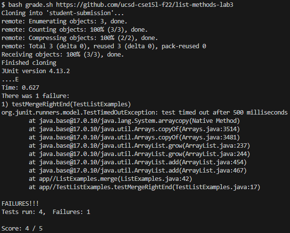
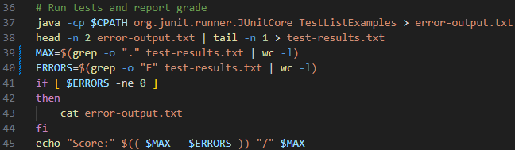

# Lab Report 5: Putting it All Together (Week 9)

## Part 1: Debugging Scenario

1. The original post from a student
### grep -c not counting occurrences properly  
To calculate the grade, I am trying to count the number of times `.` and `E` appear in the JUnit error message. This is my `grade.sh` script:    
    
However, the score does not match the number of tests and fails.    
    
The `test-results.txt` file contains "....E" after running the script. Am I using `grep -c` wrong? How do I correctly count the number of occurrences of a character?

3. A response from a TA

4. Information the student received

a. The file & directory structure needed
b. The contents of each file before fixing the bug
c. The full command line that triggered the bug
d. What to edit to fix the bug

## Part 2: Reflection

